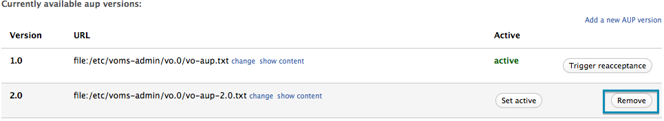
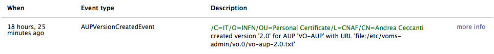
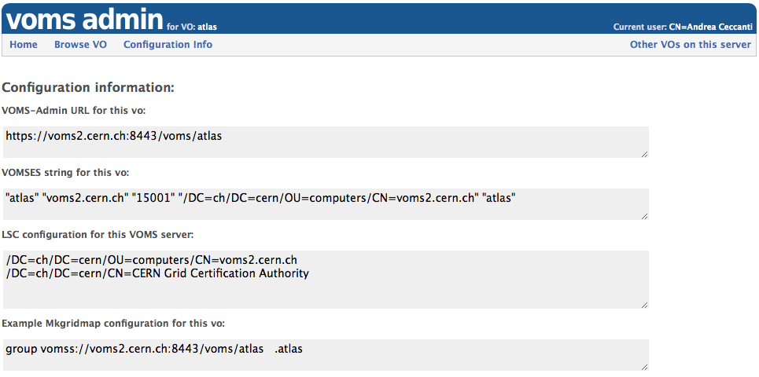

# VOMS Admin VO administrator guide


#### Table of contents

- [Introduction](#intro)
- [Managing user requests](#managing-user-requests)
  - [The Group-Manager role](#group-manager-role) <span class="label label-important">new</span> 
  - [Group managers](#group-managers)
- [Managing groups](#managing-groups)
  - [The Group Information page](#group-info-page)
- [Managing roles](#managing-roles)
  - [The Role Information page](#role-info-page)
- [Managing Generic Attributes](#managing-attributes)
  - [Attribute class management](#attribute-class-management)
  - [Assigning Generic Attributes to users, groups and roles](#assigning-gas)
  - [Search attribute value assigned to users](#ga-search)
- [Managing user information](#managing-user-information)
  - [The Browse users page](#browse-users-page)
  - [The User information page](#user-info-page)
  - [Suspending a VO member](#user-suspend)
  - [Manage the VO member personal information](#manage-personal-info)
  - [Assign the VO member to groups and roles](#vo-member-groups-roles)
  - [Manage the VO member certificates](#manage-certificates)
  - [Show information about AUP signatures](#aup-show)
  - [Change the HR id for a VO member](#change-hr-id)
- [Acceptable Usage Policies management](#manage-aup)
  - [The AUP management page](#aup-management-page)
  - [Change the AUP acceptance period](#aup-change-reacc-period)
  - [AUP version management](#aup-version-management)
- [The Audit Log](#audit-log) <span class="label label-important">new</span> 
  - [The Audit Log Record](#audit-log-record)
- [Authorization management](#manage-authz)
  - [VOMS permission compact form](#voms-permission-compact-form)
  - [ACL inheritance](#acl-inheritance)
  - [Managing ACLs](#managing-acls)
- [The configuration info page](#configuration-info-page)

#### Other VOMS Admin guides

- [VOMS Admin user guide](user-guide.html)

## Introduction <a name="intro"></a>

In VOMS, a Virtual Organisation (VO) is a named container for a set of VO
members organized in groups. As an example, the `atlas` VO at CERN has 3000
registered users and 70 groups.

VOs are managed by one or more VO administrators, i.e. privileged users
that are responsible for defining the VO structure (groups, roles, attribute
classes), approve user requests and perform other administrative tasks.

This guide is targeted at **VO administrators**. It introduces the main
VOMS administration concepts and functions.

## Managing user requests <a name="managing-user-requests"></a>

VO administrators are responsible of managing user requests. User requests
can be of the following types:

- VO membership requests, i.e., VO registration requests
- Group membership requests, i.e., requests issued to be added to a VO group
- Role assignment requests, i.e., requests issued to be assigned a given VOMS role
- Certificate requests, i.e., requests to add an additional certificate to a given VOMS membership
- Membership removal requests, i.e. requests to be removed from the VO

All pending requests are shown in the VO administrator home page, shown below:


When moving the mouse pointer over a request, the approve and reject buttons
appear to approve/reject each request.

It is also possible to approve/reject multiple requests with a single click, by
selecting them and then approve/reject them with the buttons in the upper right
corner of the request table:


### The Group-Manager role <a name="group-manager-role"></a>

Starting with version 3.4.0, VOMS Admin provides support for the
'Group-Manager' VOMS role, which, when assigned to a VO member in the context a
group, grants privileges to manage group and role requests for such group.

To enable the 'Group-Manager' role:

- Create the 'Group-Manager' Role (see [managing roles](#managing-roles)). If
  the 'Group-Manager' role already exists for the VO, and has a different
  meaning and use, a custom name for the 'Group-Manager' role can be
  configured. See [VOMS Admin service administrator][service-admin-guide] for
  details.

- Assign the Group-Manager role to those users that will serve as Group
  managers in the context of the managed group **and** in the root group context

Note that the Group-Manager role **does not** grant privileges to approve VO
registration requests.

### Group managers <a name="group-managers"></a>

**Group Managers** provide a way to:

- Allow the user to select which VO administrator will be informed of his VO
  registration request
- Route all group requests for a given group to a list of administrators,
  instead of notifying all administrators that have the right to handle the
  request

#### Managing group managers <a name="manage-gm"></a>

Group managers can be managed following the "Group Managers" link in the Browse
navbar.


Group managers:

- can be created only when the VO has more than one group
- can be linked to an existing VO group
- can manage more than one group

<div class="alert alert-error">
  Group managers provides a simple notification routing mechanism which
  overrides the default administrator selection algorithm implemented in VOMS
  Admin (i.e. notify all registered administrators that would have the rights
  to handle a given user request). <br/> Managers are still authenticated
  through X.509 certificates and authorized using the VOMS ACLs, so ensure that
  a valid entry is present in the ACLs granting all the required permissions
  for each Group Manager defined.
</div>

#### Setting up ACLs for Group Managers <a name="gm-acl"></a>

Each Group manager should have least the following permissions:

```
REQUEST_READ REQUEST_WRITE
```

on the VO root group **and** in the group they manage.

For more information on ACLs see the [Managing authorization](#managing-authz).


## Managing groups <a name="managing-groups"></a>

VO groups can be created and deleted from the "Groups" management page, that can be 
reached by clicking the "Browse groups" link in the VOMS admin browse navbar:


### The Group information page <a name="group-info-page"></a>

Clicking on the group name in the "Browse groups" page leads to the "Group
information" page, where information about description, membership and
attributes defined at the group level can be accessed.


- For more information regarding ACLs and VOMS Admin authorization, see the
  [Authorization management](#manage-authz) section
- For more information regarding Generic Attributes management, see the
  [Managing attributes](#managing-attributes) section

## Managing roles <a name="managing-roles"></a>

VO roles can be created and deleted from the "Roles" management page, that can be
reached by clicking the "Browse roles" link in the VOMS Admin browse navbar:


### The Role information page <a name="role-info-page"></a>

Clicking on the role name in the "Browse roles" page leads to the "Role
information" page, where information about role membership and attributes
defined at the role level can be accessed.


- For more information regarding ACLs and VOMS Admin authorization, see the
  [Authorization management](#manage-authz) section
- For more information regarding Generic Attributes management, see the
  [Managing attributes](#managing-attributes) section

## Managing Generic Attributes <a name="managing-attributes"></a>

Generic attributes (GAs) are (name, value) pairs that that can be assigned to
VO users. This information will then be encoded in the VOMS Attribute Certificate
issued by the VOMS server as a result for a voms-proxy-init request. 

GAs extend the range of attributes that VOMS can issue besides Fully Qualified
Attributes Names (FQAN), which is a fancy name for VOMS groups and roles, to
allow VOMS to issue any kind of VO membership information that can be expressed
as (name, value) pairs. Such information can then be leveraged by VOMS-aware
applications to take authorization decisions.

For their nature, GAs are issued to VO users. VOMS however provides a way to
quickly assign GAs to all the VO members that belong to a specific VOMS group
or that are assigned a specific VOMS role within a group. For this reason, you
find GA management in user, group and role management pages in VOMS Admin.

To assign GA to users, the VO admin must first create the corresponding
**Attribute Class**. The Attribute Class is used to define:

- the name of the attribute
- a description for the attribute class
- whether VOMS Admin should also enforce value uniqueness, so that the same
GA value cannot be assigned to distinct VO members.

### Attribute class management <a name="attribute-class-management"></a>

The "Attribute classes" management page can be reached by clicking on the “Attributes”
link in the navbar, and then clicking on the “Manage attribute classes” link.


GA classes can then be created, specifying the GA name, description and whether
uniqueness must be enforced on the GA values assigned directly to users. 


### Assigning generic attribute to users, groups and roles <a name="assigning-gas"></a>

Once a GA class has been created, GA values can be assigned to users, groups
and role within groups.

As mentioned above, when one GA is assigned directly to a user, the
(name,value) couple is added by VOMS to the attribute certificate returned to
user. GAs are assigned to users from the "Generic Attributes" panel in the
[User information page](#user-info-page).

When a GA is assigned to a group, or role within a group, such (name, value)
pair ends up in the Attribute Certificate of all the VO members belonging to
that group (or that have such role within a group). GAs are assigned to groups
and roles from the "Generic Attributes" panel in the [Group
information](#group-info-page) or [Role information](#role-info-page) pages.

### Search attribute assigned to users <a name="ga-search"></a>

VOMS Admin implements search over user generic attribute values assigned to
users, from the "Browse Attributes" page.


## Managing user information <a name="managing-user-information"></a>

### The Browse users page <a name="browse-users-page"></a>

The **Browse users** page provides the following functionality:

- Search users, with filters to limit the matches to suspended users or users
  that are requested to sign the AUP
- Suspend/restore multiple users
- Delete multiple users
- Extend membership for some users
- Access the user information page for a given user

The screenshot below shows the "Browse users" page for a WLCG VO:


### The user information page <a name="user-info-page"></a>

The "User Information" page gives detailed information about a VO member and
provides the administration functionalities to:

- suspend/restore the VO member
- manage the VO member personal information
- assign the member to groups and roles
- manage the VO member certificates
- show information about AUP signatures
- request AUP signature from the user
- sign the AUP on behalf of the user
- change the CERN HR id for the user (only applicable for CERN WLCG VOs)

To reach the user information page for a given VO member, click the "more info" link
for a given member from the "Browse users" page, as shown below:


### Suspending a VO member <a name="user-suspend"></a>

Suspended members are legitimate members of of the VO, but cannot obtain VOMS
attribute certificates from the VOMS server.

To suspend a single user, go to the [User information page](#user-info-page) and click
the "Suspend this user" button.


The [Browse users page](#browse-users-page) provides a way to suspend multiple users with
a single click.

### Manage the VO member personal information <a name="manage-personal-info"></a>

The VO admin can change personal information linked to a VO membership through
the "Personal information" panel in the [User information page](#user-info-page).


For WLCG VOs some fields cannot be changed as the member personal information
is synchronized with the contents of the CERN Human Resource database.

### Assign the VO member to groups and roles <a name="vo-member-groups-roles"></a>

The "Groups and roles" panel in the [User information page](#user-info-page) provides
the ability to add the VO member to VO groups and assign him VO roles.


### Manage the VO member certificates <a name="manage-certificates"></a>

The "Certificates" panel in the [User information page](#user-info-page) provides
the following functionality:

- add an additional certificate linked to the VO membership
- remove a certificate linked to the VO membership (if more than one are listed)
- suspend a certificate linked to the VO membership


### Show information about AUP signatures <a name="aup-show"></a>

For general information about AUP management, see the [AUP management
section](#managing-aup).

The "AUP acceptance status" panel in the [User information
page](#user-info-page) provides the following functionality:

- shows when the AUP was last signed by the user, and when the signature will
  expire
- provides the ability to request a new AUP signature from the user, with the
  "Request AUP reacceptance" button


The "Sign AUP on behalf of the user" button at the top of the [User information
page](#user-info-page) allows a VO admin to sign the AUP on behalf of a user.


### Change the CERN HR id for a VO member (WLCG CERN VOs only) <a name="change-hr-id"></a>

The "Change HR id" button, at the top of the [User information
page](#user-info-page), allows to change the CERN Human Resource identifier
linked to a VOMS membership.


The HR id entered will be validated by VOMS to check if a valid membership for
the experiment linked to such id and the currently managed VO is found in the
HR database. 
If the check succeeds, the membership information will be synchronized with the
content of the HR membership record at the next run of the VOMS HR database
synchronization task.

## Acceptable usage policy (AUP) management <a name="manage-aup"></a>

For security and policy reasons, VO members are request to comply and accept
periodically an Acceptable Usage Policy (AUP) document managed by VO
administrators that describes the policy that regulates access to resources
shared under the auspices of a VO.

VOMS Admin supports this implementing AUP management and keeping track of when
users signed a certain version of the VO AUP document. Under the hood, VOMS
Admin maintains an **acceptance record** for each user, that keeps track of
which version of the AUP was signed by the user and when.

At any time, there is an AUP document marked as **active**. This is the
document that is presented to VO members that need to sign the AUP, either
because their signature has expired or because they are registering for
membership in the VO.

The AUP in VOMS Admin has a configurable acceptance period. By default this period is
twelve months, so every twelve months each VO member is requested to sign the AUP
document in order to be compliant with the VO policy rules.
To enforce this constraint, VOMS admin checks each user's acceptance record
against the currently valid AUP acceptance period. If the user AUP signature
has expired, the user is notified by email and asked to sign again the AUP.

The user has typically a two weeks grace period (the period duration is
configurable) to sign the AUP after his signature has expired. If the user
fails to sign the AUP during this grace period, he is automatically suspened by
VOMS Admin.

The membership is suspended only until the user signs the AUP following the
instructions sent to him by email, or a VO admin signs the AUP on behalf of the
user.

**Important**: no intervention is normally requested from the VO admin to
restore the user membership, as the user can restore his membership at any time
by just signing the AUP as requested.

### The AUP management page <a name="aup-management-page"></a>

The AUP management page can be reached from the "Browse AUP" link in the browse navbar
and provides the following functionality:

- Show the currently active AUP text
- Change the AUP acceptance period (in days)
- Add a new AUP version
- Delete an AUP version that is not marked as active
- Set the active AUP version
- Trigger acceptance for the active AUP version


### Change the AUP acceptance period <a name="aup-change-reacc-period"></a>

The default acceptance period duration for the VO AUP is 365 days. This period
can be changed by VO administrators, using the change acceptance period form
highlighted in the screenshot below:


<div class="alert alert-error">
  <strong>Warning!</strong>
  Changing the acceptance period may lead to the invalidation of AUP signatures
  for a large number of users, so use this with caution.
</div>

### AUP version management <a name="aup-version-management"></a>

VOMS Admin allows to keep multiple versions of the AUP document. Only one of
these versions is marked as active and presented to users for acceptance.

VOMS Admin stores the AUP as URL pointing to a text file. The default AUP is a file
residing in the configuration folder on the VOMS Admin server.

When an AUP version is marked as active, all users that do not have a valid
acceptance record for that version are requested to sign the AUP.

<div class="alert alert-info">
 <strong>Important!</strong>
  Note that you're <strong>not</strong> required to create a new version of the
  AUP to request acceptance from user as a consequence of AUP document changes.
  If the AUP location does not change, you can keep the version fixed and
  request a new signature from users with the "Trigger acceptance" button.
</div>

#### Add a new AUP version

To add a new AUP version, follow the "Add a new AUP version" link in the "AUP management page".


#### Delete an AUP version not marked as active

AUP versions not marked as active can be deleted with the "Remove" button in the "AUP management page"



#### Set the active AUP version

If multiple versions of the AUP are available, the active version can be changed with the "Set active" button
in the "AUP management page."


<div class="alert alert-error">
  <strong>Warning!</strong>
  Changing the active AUP version will likely trigger an acceptance request to <strong>all</strong> VO
  members. Use this with caution.
</div>

#### Trigger acceptance for the active AUP version

The VO administrator can request a new signature of the AUP from **all** the VO
users with the "Trigger acceptance" button.


<div class="alert alert-error">
  <strong>Warning!</strong>
  Triggering acceptance for the active AUP version will invalidate all VO
  member signatures and trigger an acceptance request to
  <strong>all</strong> VO members. Use this with caution.
</div>

## The Audit Log <a name="audit-log"></a>

Starting with version 3.4.0, VOMS Admin keeps an audit log of all the
actions that change the content of the VOMS database.

The audit log can be accessed by following the "Audit Log" link in the browse
navbar.


The page shows the last week of records in the audit log. To change the period use the
"From" and "To" fields in the record filter bar, which supports filtering by Principal and
event type:


### The Audit Log record <a name="audit-log-record"></a>

Each audit log record describes an event that changed the contents of the VOMS
database, providing the following information:

- The time of the event
- The type of event, i.e., what action was triggered that changed the VOMS database
- The principal, i.e.,  who triggered the action that changed the VOMS database
- A description of the event
- The event data, i.e., what information has changed in the VOMS database

A compact representation of a log record is shown in the screenshot below:



Clicking the "more info" handle turns on the expanded log record view, which displays
the event data in full.


## Authorization management <a name="manage-authz"></a>

In VOMS-Admin, each operation that accesses or modifies the VOMS database is
authorized via the **VOMS-Admin Authorization framework**.

Authorization policies are expessed as **Access Control Lists** (ACLs) linked to
VOMS groups. ACLs are composed of **Access Control Entries** (ACEs), which define a
mapping between a *Principal* and a set of *VOMS Admin permissions*.

A **Principal**, in the context of an ACE, may be:

- A VO administrator for the VO, identified by the subject of an X.509
  certificate
- A VO user
- A VOMS Fully Qualified Attribute Name (FQAN), i.e. any user in the VO who
  belongs to a certain VO group or role
- Any authenticated user, i.e. any user that presents a certificate issued by a
  trusted CA

A **VOMS Admin Permission** is a fixed-length sequence of permission flags that
describe the set of permissions a VOMS Administrator has in a specific VOMS group.
The following table explains in detail the name, meaning and valid scopes of
these permission flags:

<table>
  <thead>
    <th>Flag name</th>
    <th>Meaning</th>
    <th>Valid scope</th>
  </thead>
  <tbody>
    <tr>
      <td><code>CONTAINER_READ</code><br/><code>CONTAINER_WRITE</code></td>
      <td>These flags are used to control access to the operations that list/alter the VO internal structure (groups and roles list/creations/deletions, user creations/deletions)</td>
      <td>All VO groups</td>
    </tr>
    <tr>
      <td><code>MEMBERSHIP_READ</code><br/><code>MEMBERSHIP_WRITE</code></td>
      <td>These flags are used to control access to operations that manage/list membership in group and roles.</td>
      <td>All VO groups</td>
    </tr>
    <tr>
      <td><code>ATTRIBUTES_READ</code></br><code>ATTRIBUTES_WRITE</code></td>
      <td>These flags are used to control access to operations that manage generic attributes (at the user, group, or role level).</td>
      <td>The VO root group</scope>
    </tr>
    <tr>
      <td><code>ACL_READ</code></br><code>ACL_WRITE</code></br><code>ACL_DEFAULT</code></td>
      <td>These flags are used to control access to operations that manage VO ACLs and default ACLs.</td>
      <td>All VO groups</td>
    </tr>
    <tr>
      <td><code>REQUESTS_READ</code></br><code>REQUESTS_WRITE</code></td>
      <td>These flags are used to control access to operations that manage subscription requests regarding the VO, group membership, role assignment etc...</td>
      <td>All VO groups</td>
    </tr>
    <tr>
      <td><code>PERSONAL_INFO_READ</code></br><code>PERSONAL_INFO_WRITE</code></td>
      <td>The flags are used to control access to user personal information stored in the database.</td>
      <td>The VO root group</scope>
    </tr>
    <tr>
      <td><code>SUSPEND</code></td>
      <td>This flag controls who can suspend other users.</td>
      <td>The VO root group</scope>
    </tr>
  </tbody>
</table>

<div class="alert alert-info"> <strong>Notice</strong> Altough VOMS Admin
allows to display and define ACLs also for Role scopes, like
<code>/atlas/Role=VO-Admin</code>, these ACLs are <strong>NOT</strong> currently used for authorization.
</div>

Each operation in VOMS Admin is authorized according to the above set of
permissions, i.e., whenever an administrator tries to execute such operation,
its permissions are matched with the operation's set of required permission in
order to authorize the operation execution.

### VOMS permission compact form <a name="voms-permission-compact-form"></a>

In the following screenshot the VOMS Admin permissions granted to
the `/vo.0/Role=VO-Admin` principal are expressed in compact form:


The representation above is equivalent to the following set of permissions
(i.e., all permissions):

- CONTAINER\_READ
- CONTAINER\_WRITE
- MEMBERSHIP\_READ
- MEMBERSHIP\_WRITE
- ACL\_READ
- ACL\_WRITE
- ACL\_DEFAULT
- ATTRIBUTES\_READ
- ATTRIBUTES\_WRITE
- REQUESTS\_READ
- REQUESTS\_WRITE
- PERSONAL\_INFO\_READ
- PERSONAL\_INFO\_WRITE
- SUSPEND

VOMS Admin also shows another more compact representation of a set of
permissions in the [Delete ACE page](#delete-ace-page):


The representation above is equivalent to the following set of permissions:

- CONTAINER\_READ
- MEMBERSHIP\_READ
- PERSONAL\_INFO\_READ

### ACL inheritance <a name="acl-inheritance"></a>

In VOMS Admin, each group, at creation time, inherits the parent's group ACL.

It is possible to change this behaviour leveraging via **Default ACLs**. When the
Default ACL is defined for a group, children groups inherit the Default ACL
defined at the parent level instead of the parent's group ACL. 

<div class="alert alert-warning">
  <strong>Warning</strong> Default ACLs are only useful if an administrator
  wants the ACL of children groups to be <strong>different</strong> from the
  one of the parent's group. In normal situations, Default ACLs should be
  <strong>avoided</strong>.
</div>

### Managing ACLs <a name="managing-acls"></a>

VO ACLs are managed from the "Manage ACL" page, that can be reached following the
"Browse ACL" link in the VOMS Admin Browse navbar.


The screenshot above shows the ACL for the `vo.0` root group. The ACL has three entries:

1. The first entry that grants all permissions to anyone with the `/vo.0/Role=VO-Admin`
2. The second entry grants VO browse permissions to any authenticated users
3. The third entry grants all permission to the 'Andrea Ceccanti'
   administrator, authenticated with his INFN CA personal certificate

The context can be changed using the ACL context selection form, highlighted in
green in the screenshot above. Default ACLs are shown by clicking on the
"Default ACL" checkbox.

<div class="alert alert-info"> <strong>Notice</strong> Altough VOMS Admin
allows to display and define ACLs also for Role scopes, like
<code>/atlas/Role=VO-Admin</code>, these ACLs are <strong>NOT</strong> currently used for authorization.
</div>

#### ACL entries management <a name="ace-management"></a>

From the [Manage ACL page](#managing-acls):

- new ACL entries are defined by following the "Add entry" link at the top of list ACL table
- existing ACL entries are edited by following the "Edit" link for the entry
- existing ACL entries are deleted by following the "Delete" link for the entry


##### The Add ACL entry page <a name="add-ace-page"></a>

The principal selection control at the top of the page allows to select the
Principal for the ACE that is being added.

The permission selection table allows to select which permission in the current context
will be granted by the ACE.

The "propagate entry to children contexts" checkbox allows to propagate the
entry to children groups. It is usually recommended to leave this checkbox
selected when adding ACEs.


##### The Delete ACL entry page <a name="delete-ace-page"></a>

The delete ACE page shows information about the ACE being removed, in particular

- The principal (termed Admin in the page)
- The context from which the ACE is being removed
- The ACE permission set, represented in [compact form](#voms-permission-compact-form)

The "Remove also from children context" checkbox allows to remove the ACE also
from children groups. It is usually recommended to check this control when
removing ACEs.


## The configuration info page <a name="configuration-info-page"></a>

The Configuration info page shows configuration information useful for voms
clients, like the vomses string for the VO or a mkgridmap example
configuration.



[service-admin-guide]: #theguide
