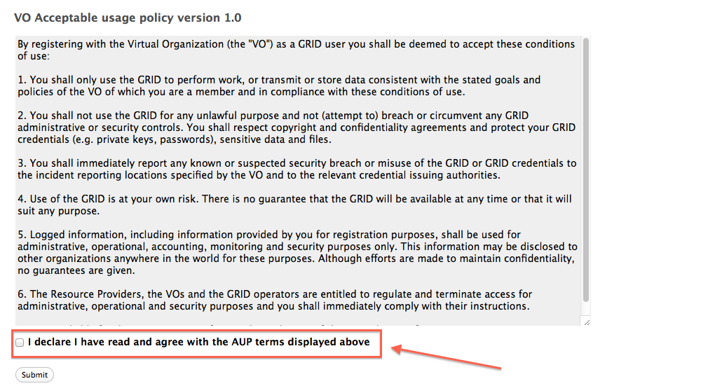
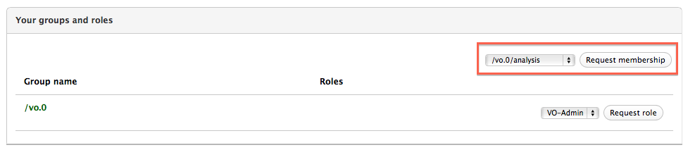

# VOMS Admin user guide



#### Table of contents

- [Introduction](#intro)
- [The certificate information page](#certificate-info)
- [Registering to a VO](#registration)
- [The user home page](#user-home)
- [Signing the Acceptable Usage Policy](#aup-signature)
- [Requesting group membership and role assignment](#user-requests)
- [Requesting membership removal](#membership-removal-request)
- [Membership expiration](#membership-expiration)

#### Other VOMS Admin guides

- [VOMS Admin VO administrator guide](vo-admin-guide.html)

## Introduction <a name="intro"></a>

This user guide is targeted at VO members. It describes how to:

- understand which certificate is store in the browser that is used to contact
  the VOMS Admin service
- register to a Virtual Organisation managed with VOMS Admin
- answer a Sign AUP request, and how to restore the membership in case the AUP
  is not signed in the granted grace period
- request group membership and role assignment
- link additional certificates to a membership
- issue a request to be removed from the VO

## The certificate information page <a name="certificate-info"></a>

The certificate information page can be accessed by clicking the "Certificate info" link in the main
VOMS Admin navigation bar, as highlighted in the picture below:


The certificate information page displays information about the certificate used to connect to a VOMS Admin
server, and in particular:

- The certificate subject, issuer, serial number and expiration date
- Whether the certificate is linked to a VO membership
- Whether the certificate grants administrator privileges for the VO

Below is an example screenshot that shows a certificate not bound to any VO membership:


When no valid certificate is used to connect to VOMS Admin, the certificate info page will be as follows:


## Registering to a VO <a name="registration"></a>

In order to register to a VO a user needs to have a valid X.509 certificate in the browser.
To check that a valid certificate is registered in your browser, point your browser to the VOMS Admin
[certificate information page](#certificate-info).

### WLCG CERN VOs

The registration process is different for WLCG CERN VOs, whose users are
required to be registered in the CERN Human Resources (HR) db in order to be
eligible for VO membership.

The VO registration, in this case, works as follows:

- The user must find its CERN HR membership record, this can be done by
   providing the email address linked to such record, as in the following
   screenshot:


VOMS Admin will then see if there is a valid membership linked to the
experiment in the HR DB matching the provided email address. If a record is
found, VOMS Admin will ask for confirmation to the user, as in the following
screenshot:


Clicking on the "It's me!" brings the user to the next step in the registration

- The user enters his address and phone number (other personal information is taken
from the HR database) and agrees with the VO Acceptable Usage Policy (AUP)


The applicant can also enter a message that will be shown to the VO administrators
handling the VO membership request.

At this point VOMS sends an email with a request confirmation link that should be opened by
the user **using the same browser used during these first registration steps**.

Once the request has been confirmed by the applicant, VO administrators are informed of the
request and will either approve it or reject it. The user will be informed of the request
outcome with an email similar to the following:

```
Dear andrea.ceccanti@cnaf.infn.it,

your vo membership request for VO test.vo has been approved.

Your sincerely,
The Voms-Admin registration service for VO test.vo
```

### Non WLCG VOs

The registration process for non-WLCG VOs is identical to the process for WLCG VOs starting from step 2.


## The User home page <a name="user-home"></a>

Once registered, the user will find the following information about his membership in the home page:

- Personal information like name, surname, address and email address
- The certificates linked to the VOMS membership
- Groups and roles assigned to the user
- AUP signature status
- User request history

### Changing user personal information

#### CERN WLCG VOs

VO members cannot change their personal information, as this information is synchronized with the CERN Human Resources database.

#### Other VOs

VO members can update his personal information through the personal information panel:


### Managing registered certificates

The certificates panel displays information about certificates linked to the membership. User can request the addition of
a new certificate to their membership by clicking the  "Add an additional certificate" button, as in the screenshot below:


Note that the addition of a new certificate to a membership must be approved by VO administrators.

#### Add certificate page

In order to add a certificate the user must either upload the certificate file that she wants to be added to the membership, or
specify a subject and select the CA for the certificate to be added, as shown in the following screenshot:


Note that the user **cannot** request the addition of a certificate that is already bound to another VO member.

Clicking the "Request certificate" button generates a new certificate request in the VOMS Admin database and triggers a notification
to VO administrators, that will either accept or refuse the user request.

## Signing the Acceptable Usage Policy <a name="aup-signature"></a>

VO members need to sign the VO Acceptable Usage Policy (AUP) periodically (typically every 12 months).
VOMS Admin will send a set of reminder emails to the user that needs to sign the AUP like the following:

```
Dear andrea.ceccanti@cnaf.infn.it,

you are requested to sign the VO test.vo AUP in order to continue to
be part of the  test.vo VO.

To sign the AUP, point your browser to the following URL:

https://vgrid02.cnaf.infn.it:8443/voms/test.vo/aup/sign!input.action?aupId=1
...
```

The above URL leads to the VOMS AUP signature page:  


and **MUST** be opened with a browser that holds the user certificate linked to
the VO membership.
The user has, by default, 14 days to sign the AUP. During this period, the user
home page is as follows:


After this grace period, if the user did not sign the AUP, the user is suspended.
While suspended the user cannot get VOMS credentials and access Grid services.
The user can however restore his membership at any time by signing the AUP:


## Requesting group membership and role assignment <a name="user-requests"></a>

VO members can request group membership and role assignment from their home page.



VO members are now requested to provide a reason for their request, as in the following
screenshot:


Pending requests are shown in red in the groups and roles panel:


VOMS Admin will send an email to the VO member to inform whether the VO
administrators have approved or rejected the group/role membership request.

## Requesting membership removal <a name="membership-removal-request"></a>

VO members can also request removal from the VO by clickin the "Request membership removal" in
the top right corner of the home page.


Also in this case, the user must provide a motivation for the membership
removal request that will be shown to VO administrators.

## Membership expiration <a name="membership-expiration"></a>

Each VO membership has a linked expiration time, that is shown at the top of
the user home page.


Once membership expires VO members are typically suspended. In this case,
VO members **CAN NOT** do anything to restore their membership. It is entirely up to VO adminstrators,
that are notified of VO members membership expiration, to decide whether they
want to extend the membership lifetime or leave the VO member suspended.
