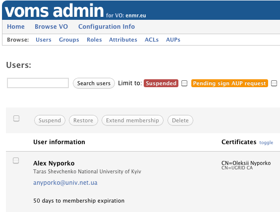

	<h2>Latest News</h2>

	
	

		    

			    
{{ post.date | date_to_long_string }}

		    

		    

		    <h3>{{post.title}}</h3>
		    
{{post.summary}}

		    
	            <a href="{{ site.baseurl }}{{post.url}}">Read more</a>
				
		

	

	

	

		<h2 class="">Organization management</h2>
        
In a nutshell, VOMS provides the tools to enable Virtual Organizations and attribute-based authorization in distributed contexts.

		
VOMS supports a rich registration process compliant with the <a href="https://documents.egi.eu/public/RetrieveFile?docid=79&version=6&filename=EGI-SPG-VOManagement-V1_0.pdf">EGI policies on VO registration services</a>. Users can be organized in groups and can be assigned roles and other types of
        attributes.

	

	

		
	

	

		<h2 class="">Client tools</h2>
		

			VOMS clients are used to request a signed token (an Attribute Certificate compliant with 
			<a href="http://www.ietf.org/rfc/rfc3281.txt">RFC 3281</a>) from a VOMS server. 
			This token carries the attributes that a person holds in a certain VO, and is usually embedded inside an <a href="http://www.ietf.org/rfc/rfc3820.txt">X509 Proxy Certificate</a>. 
			The proxy certificate is used to drive authentication and authorization decisions when accessing third party services.
		

	

	

		
	

	

		<h2>APIs for attribute based authorization</h2>
		
VOMS APIs come in Java and C/C++ bindings and enable easy integration of VOMS-based authorization in existing services.

	

	

		
	

