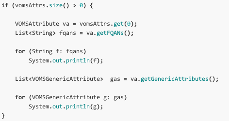

		<h1 class="text-center">VOMS</h1>
		
VOMS (Virtual Organization Membership Service) In accumsan mauris arcu, vel ultricies urna porta sed. Mauris feugiat vel justo quis consectetur. Ut feugiat orci tincidunt ante auctor, eget varius sem gravida. Mauris tempus cursus vulputate. Vestibulum ante ipsum primis in faucibus orci luctus et ultrices posuere cubilia Curae; Donec facilisis tortor in purus blandit sagittis.
 
		
In accumsan mauris arcu, vel ultricies urna porta sed. Mauris feugiat vel justo quis consectetur. Ut feugiat orci tincidunt ante auctor, eget varius sem gravida. Mauris tempus cursus vulputate. Vestibulum ante ipsum primis in faucibus orci luctus et ultrices posuere cubilia Curae; Donec facilisis tortor in purus blandit sagittis. Nulla molestie velit turpis, id pellentesque nulla lobortis vel. Praesent hendrerit erat ac sapien tincidunt, vel condimentum leo accumsan. Etiam sit amet nibh lorem. Phasellus eleifend vulputate libero id sollicitudin. Duis aliquet ultricies dolor, non sollicitudin erat lacinia quis. Vestibulum ac purus consequat, molestie erat et, adipiscing nulla.
		

	

		<h2 class="">Organization management</h2>
		
VOMS provides a web application for managing organizations. Support groups, roles, generics attributes, registration, cazz and mazz. In accumsan mauris arcu, vel ultricies urna porta sed. Mauris feugiat vel justo quis consectetur. Ut feugiat orci tincidunt ante auctor, eget varius sem gravida. Mauris tempus cursus vulputate. Vestibulum ante ipsum primis in faucibus orci luctus et ultrices posuere cubilia Curae; Donec facilisis tortor in purus blandit sagittis.
		

	

	

		
	

	

		<h2 class="">Client tools</h2>
		
VOMS provides client tools to get bla bla bla. Support groups, roles, generics attributes, registration, cazz and mazz. In accumsan mauris arcu, vel ultricies urna porta sed. Mauris feugiat vel justo quis consectetur. Ut feugiat orci tincidunt ante auctor, eget varius sem gravida. Mauris tempus cursus vulputate. Vestibulum ante ipsum primis in faucibus orci luctus et ultrices posuere cubilia Curae; Donec facilisis tortor in purus blandit sagittis.
		

	

	

		
	

	

		<h2 class="">API</h2>
		
VOMS provides an API to bla bla bla. Support groups, roles, generics attributes, registration, cazz and mazz. In accumsan mauris arcu, vel ultricies urna porta sed. Mauris feugiat vel justo quis consectetur. Ut feugiat orci tincidunt ante auctor, eget varius sem gravida. Mauris tempus cursus vulputate. Vestibulum ante ipsum primis in faucibus orci luctus et ultrices posuere cubilia Curae; Donec facilisis tortor in purus blandit sagittis.
		

	

	

		
	

	

		<h2 class="">Attribute based authorization</h2>
		
Services uses VOMS attributes to take authorization decisions. In accumsan mauris arcu, vel ultricies urna porta sed. Mauris feugiat vel justo quis consectetur. Ut feugiat orci tincidunt ante auctor, eget varius sem gravida. Mauris tempus cursus vulputate. Vestibulum ante ipsum primis in faucibus orci luctus et ultrices posuere cubilia Curae; Donec facilisis tortor in purus blandit sagittis.
		

	

	

		
	

