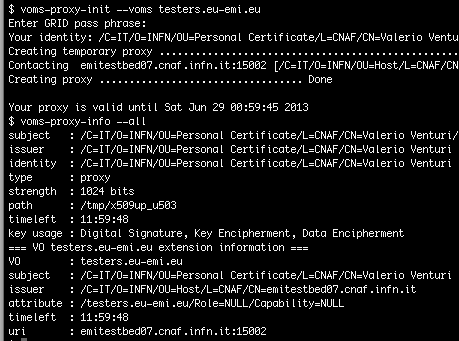

<!--

	<h2>News</h2>



	    

		    
{{ post.date | date_to_long_string }}

	    

	    

            <h3>{{post.title}}</h3>
            
{{post.summary}} <a href="{{post.url}}">more</a>

			
        


-->

	

		<h2 class="">Organization management</h2>
		
VOMS provides a web application for managing organizations. It support a rich registration process with AUP acceptance enforcement and membership expiration. Users can be assigned to groups and can be given roles and generics attributes.

		
Or VO administrators can use a command line client for management.

		
	

	

		
	

	

		<h2 class="">Client tools</h2>
		
A user can use the VOMS clients to request a signed token (an Attribute Certificate compliant to <a href="http://www.ietf.org/rfc/rfc3281.txt">RFC 3281</a>) from a VOMS server that state that she belongs to the VO and embed it in to an <a href="http://www.ietf.org/rfc/rfc3820.txt">X509 Proxy Certificate</a>. When authenticating to third party services using the proxy, the user brings along this information that services may use to drive authorization decisions.
		

	

	

		
	

	

		<h2>APIs for attribute based authorization</h2>
		
Services can uses VOMS attributes to allow access to resources. When authenticating users using proxy certificates, they can extract VOMS attributes from the proxy using the VOMS API and use them in the authorization process.

		
The VOMS API come in Java and C/C++ bindings. It allows services to extract VO membership information from the proxy certificate authentication and use it to take authorization decisions.

	

	

		
	

